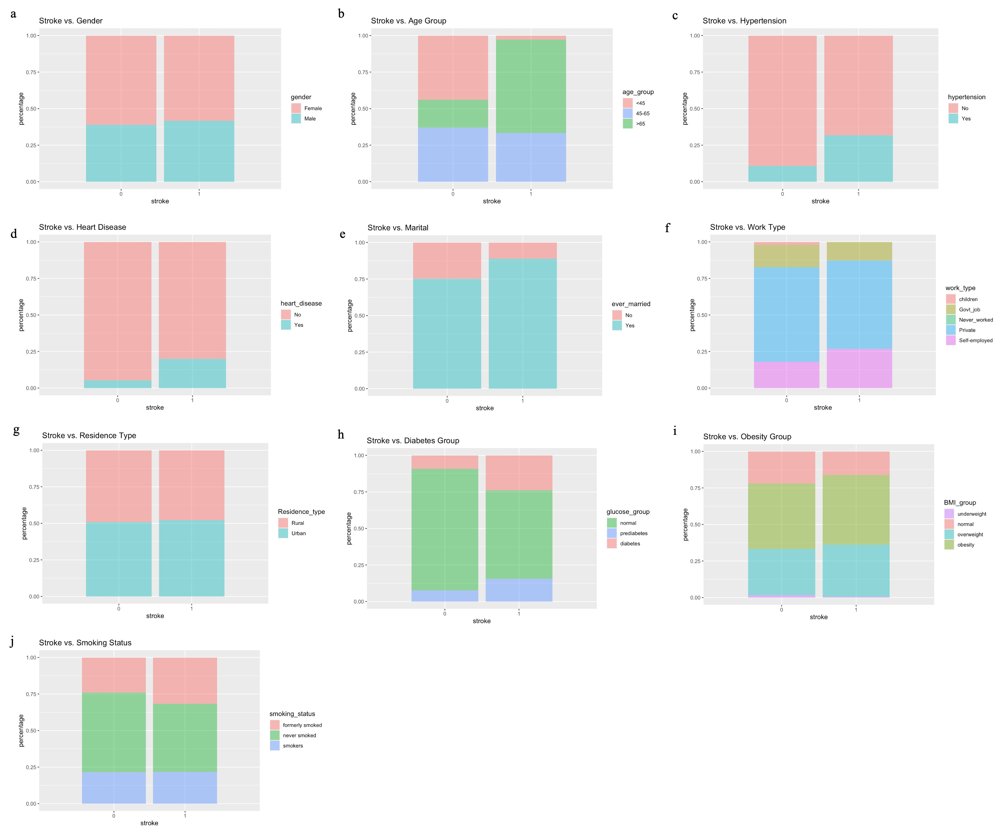

A stroke occurs when the blood supply to part of the brain is blocked or when a blood vessel in the brain bursts. In either case, a stroke will cause long-term brain damage, disability, or even death [1]. Stroke ranks as the second leading cause of death in the world [2], and more than 795,000 people in the U.S. have a stroke each year [3]. Stroke-related costs, including the cost of health care services, medicines, and missed days of work, are about $53 billion in the U.S. between 2017 and 2018 [3]. High blood pressure, high cholesterol, diabetes, obesity, heart disease, sickle cell disease, age, sex, race and ethnicity, and family history and genetics are major risk factors for stroke [4]. Recognizing the prevalence, complexity, potentially devastating consequences, and social burden of stroke, this study investigates potential risk factors for stroke and whether a patient’s likelihood to get a stroke can be predicted by his/her demographic plus clinical features. The results of this study could provide insights for the establishment of earlier and more accurate stroke warnings given a patient’s information, which would make the patient be more mindful of his/her health condition so that, ideally, he/she could avoid the worst outcome by seeking immediate help. 

## Dataset and data preprocessing

This study used the “Stroke Prediction Dataset” downloaded from the Kaggle website [5], which contains 5110 observations among which 249 are participants who had a stroke event and 4861 are healthy controls. Besides the stroke event, this dataset provides information including gender, age, hypertension, heart disease, marital status, work type, residence type, average glucose level in the blood, body mass index (BMI), and smoking status for each participant. \

Since the goal of the study is to predict the stroke event based on available demographic plus clinical features, the single participant with gender recorded as “other” plus participants with missing data for BMI and smoking status were removed to ensure completeness of the input dataset. After removal, the dataset was left with 3425 observations among which 5.3% had a stroke event. The characteristics of these remaining participants are shown in the table below. To warrant clinical meaning to this study, three variables – age, average glucose level in blood, and BMI – were redefined and recategorized. Age was broken down into three categories: “<45,” “45-65,” and “>65.” Diabetes status was labeled based on the average glucose level in the blood: “normal” if < 140 mg/dL, “prediabetic” if between 140 mg/dL to 199mg/dL, “diabetic” if  $\geq$ 200 mg/dL [6]. Obesity status was labeled based on BMI: “underweight” if  $\leq$ 18.5 kg/m2, “normal” if between 18.5 kg/m2 and 24.9 kg/m2, “overweight” if between 25 kg/m2 and 29.9 kg/m2, and “obese” if $\geq$ 30 kg/m2 [7].\

{width=40%}

## Exploratory data analysis
After data preprocessing, all predictors for the stroke event become categorical variables for this study. Therefore, an exploratory data analysis was done to see whether certain levels within each predictor are overly represented in the stroke group. Through visualizing the plots, the stroke group contains more people aged >65, who have hypertension, heart disease, and are. Therefore, age, hypertension, heart disease, and diabetes status could be significant predictors of the stroke event.

{width=70%}

## Analytical methodology
The outcome variable for this study is the occurrence of the stroke event, which is a dichotomous outcome with levels 0 and 1. Therefore, a logistic regression model is appropriate for modeling this outcome variable. This study fitted two logistic regression models: the full model predicted the stroke event with all the available demographic and clinical information while the simple model predicted the stroke event using only continuous age variable. The simple model was created to comparatively assess the performance of the more complicated full model. After separating the dataset into a training and a test set with a ratio of 8:2, the final model that contains only statistically significant predictors from the full model was fitted to the training set. Since the healthy controls are disproportionally overrepresented in the dataset, a precision versus recall curve (PRC) was generated to determine the threshold probability for assigning the predicted probabilities to the two outcome levels – stroke or healthy control. Following the same steps, the predicted outcomes using the simple model were also assigned with the two outcome levels based on the same threshold probability. Lastly, the performance of the two models was compared in terms of their AIC, accuracy, specificity, and sensitivity. 
