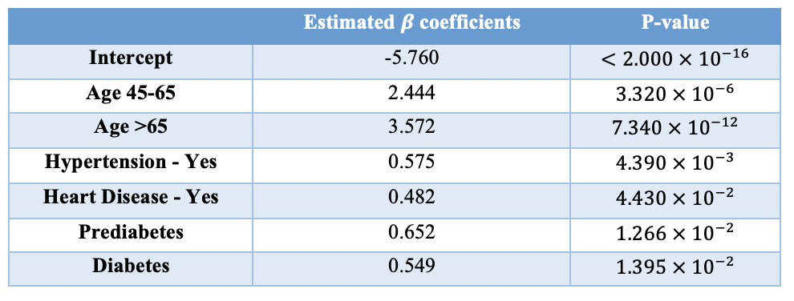
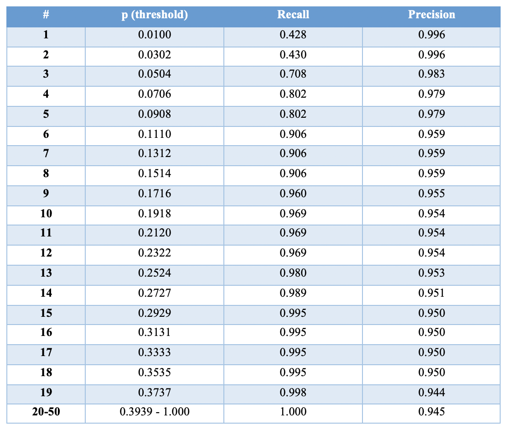
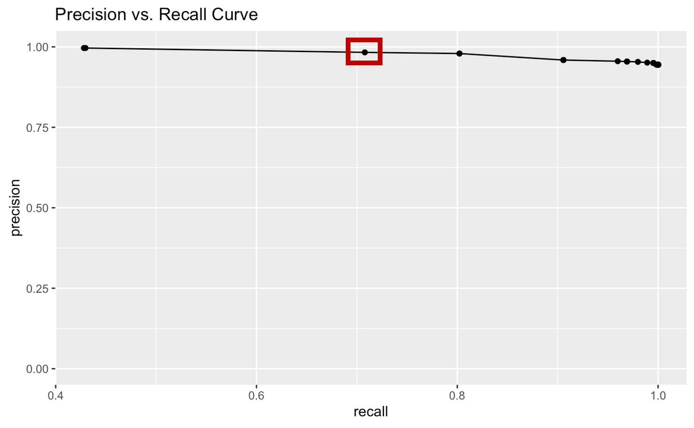
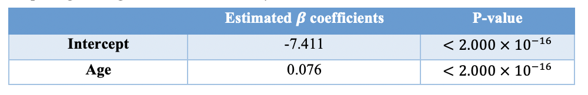
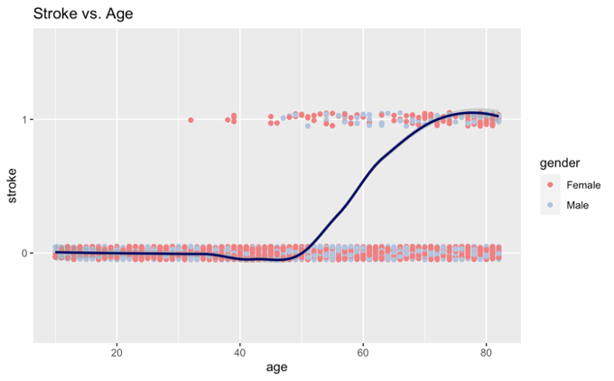
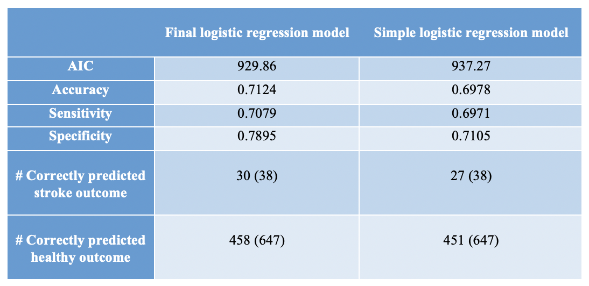

A logistic regression model that predicts the stroke event using age group, gender, hypertension, heart disease, marital status, work type, residence type, diabetes status, obesity status, and smoking status was fitted to the training set. The summary output of this model showed that only age group (45-65: p-value = $4.520 \times 10^{-6}$; >65: p-value = $8.850 \times 10^{-12}$), hypertension (p-value = $2.890 \times 10^{-3}$), heart disease (p-value = $7.975 \times 10^{-2}$), and diabetes status (prediabetes: p-value = $8.360 \times 10^{-3}$; diabetes: p-value = $8.470 \times 10^{-3}$) are statistically significant predictors. Therefore, the final logistic regression model was created by including only these significant predictors. The estimated $\beta$ coefficients and their corresponding p-values are shown in the table below.\

In addition, this model output suggests that age, hypertension, heart disease, and diabetes are all positively associated with the risk of stroke. More specifically, the odds of stroke for people with age between 45-65 is 11.52 ($e^{2.444}$) times that for people with age <45; the odds of stroke for people with age >65 is 35.59 ($e^{3.572}$) times that for people with age <45; the odds of stroke for people having hypertension is 1.78 ($e^{0.575}$) times that for people not having hypertension; the odds of stroke for people with heart disease is 1.62 ($e^{0.482}$) times that for people without heart disease; the odds of stroke for prediabetic people is 1.92 ($e^{0.652}$) times that for people with normal average glucose level in the blood; and the odds of stroke for diabetic people is 1.73 ($e^{0.549}$) times that for people with normal average glucose level in the blood.

{width=50%}

The stroke group is under-represented in the dataset as only 5.3% of the 3425 observations have had a stroke event. Therefore, using a threshold probability of 0.5 to assign predicted probabilities to the two outcome levels – stroke or healthy control – would cause concern and inaccuracy. Consequently, 50 threshold probabilities ranging from 0.01 to 1.00 were tested and their recall and precision are listed in the table below. Since the goal of this study is to predict the stroke event, instead of pursuing high recall and high precision at the same time, this study emphasized the ability of the selected threshold probability to accurately detect the stroke event. Therefore, a threshold probability of 0.0504 was chosen which detected 30 stroke events out of 38 total stroke events in the test set (Figure 2).

{width=50%}

{width=50%}

To assess the performance of the final model on predicting the outcome of interest, a simpler logistic regression was fitted to the training set. In this model, the stroke event is predicted using only the continuous age variable, which is a statistically significant predictor based on the model summary output (Table below; p-value <$2.000\times 10^{-16}$). Moreover, this model output suggests that a 1-unit increase in age is associated with 7.9% ($e^{0.076}-1=0.079$) increase in the odds of stroke, on average. 

{width=50%} 

Figure below shows that most people who had a stroke event have age greater than 45, and gender and stroke are independent in this study (none of the sex is differentially represented in the stroke or the control group). Moreover, the prediction curve has a sigmoidal shape that matches the trend of probabilities depicted by a logistic regression model.

{width=50%}

Compared to the simple model, the final logistic regression model has a lower AIC score. When using the same threshold probability of 0.0504, the final model has higher accuracy, sensitivity, and specificity. Breaking down those statistics, the final model successfully detects 30 out of 38 stroke events and 458 out of 647 healthy controls in the test set. However, the simple model only successfully detects 27 out of 38 stroke events and 451 out of 647 healthy controls in the test set (Table below). Therefore, the full model using age group, hypertension, heart disease, and diabetes status as predictors performs better in predicting the stroke event. 

{width=50%}
